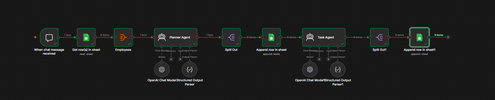

# 🤖 AI Employee Task Planner using n8n

> An AI-powered workflow automation built with **n8n**, **OpenAI**, and **Google Sheets** to generate personalized employee work plans and task assignments automatically.


---

#  Overview

This project demonstrates an intelligent workflow automation built with **n8n** that streamlines employee task planning using AI.

When a user sends a message, the workflow retrieves employee information from Google Sheets, processes the data using OpenAI-powered AI agents, generates personalized work plans and task assignments, and stores the final results back into Google Sheets.

The project showcases how AI agents can automate repetitive planning tasks while maintaining a structured workflow suitable for business operations.

---

#  Features

-  AI-powered employee task planning
-  Google Sheets integration
-  Chat-triggered workflow
-  OpenAI AI Agents for intelligent planning
-  Structured output generation
-  Data splitting and processing
-  Automatic result storage
-  End-to-end workflow automation
-  Easily customizable workflow

---

#  Workflow Architecture

```text
User Message
      │
      ▼
Chat Trigger
      │
      ▼
Read Employee Data
(Google Sheets)
      │
      ▼
Employee Processing
      │
      ▼
Planner AI Agent
(OpenAI)
      │
      ▼
Split Generated Plans
      │
      ▼
Append Planning Data
(Google Sheets)
      │
      ▼
Task AI Agent
(OpenAI)
      │
      ▼
Split Task Assignments
      │
      ▼
Append Final Output
(Google Sheets)
```

---

#  Workflow Process

### Step 1 – User Interaction

The workflow begins when a user sends a chat message.

---

### Step 2 – Retrieve Employee Data

Employee information is fetched from Google Sheets.

---

### Step 3 – Employee Processing

The workflow formats and prepares employee data for AI processing.

---

### Step 4 – AI Planning Agent

The Planner AI Agent analyzes employee information and generates personalized work plans.

---

### Step 5 – Split Planning Output

Generated plans are split into structured records.

---

### Step 6 – Store Planning Data

The planning results are appended to Google Sheets.

---

### Step 7 – AI Task Agent

A second AI Agent creates detailed task assignments based on the generated work plans.

---

### Step 8 – Final Storage

The completed task assignments are stored back into Google Sheets for future reference.

---

#  Tech Stack

| Layer | Technology |
|--------|------------|
| Automation | n8n |
| AI Model | OpenAI GPT |
| Spreadsheet | Google Sheets |
| Workflow Logic | n8n Nodes |
| Data Processing | Split Node |
| Output | Structured Parser |

---

#  Repository Structure

```
n8n-ai-automation/
│
├── README.md
├── .gitignore
│
├── workflow/
│   ├── My workflow.json
│   └── README.md
│
├── screenshots/
│   ├── workflow.png
│   └── README.md
│
└── docs/
    └── README.md
```

---

#  Installation

## Prerequisites

- n8n
- OpenAI 
- Google Account
- Google Sheets

---

## Import Workflow

1. Clone this repository.
2. Open your n8n instance.
3. Import `workflow/My workflow.json`.
4. Configure the required credentials.
5. Save and execute the workflow.

---

#  Configuration

Configure the following credentials inside n8n before execution:

- OpenAI API Key
- Google Sheets Credentials

---

#  Usage

1. Trigger the workflow with a chat message.
2. The workflow retrieves employee data.
3. AI generates personalized work plans.
4. AI assigns employee tasks.
5. Results are automatically stored in Google Sheets.

---

# 📸 Workflow Screenshot



---

#  Future Improvements

- Email notifications
- Slack or Microsoft Teams integration
- Employee workload balancing
- Calendar scheduling
- Performance analytics dashboard
- Multi-language support
- Advanced AI reasoning

---

#  Contributing

Contributions, suggestions, and improvements are welcome.

Feel free to fork the repository and submit a pull request.

---

#  Author

**Harshinee Shree G**

B.Tech – Artificial Intelligence & Data Science

- Python
- Artificial Intelligence
- n8n Automation
- OpenAI
- Google Sheets
- Workflow Automation

---

# ⭐ Support

If you found this project helpful, consider giving it a ⭐ on GitHub.
